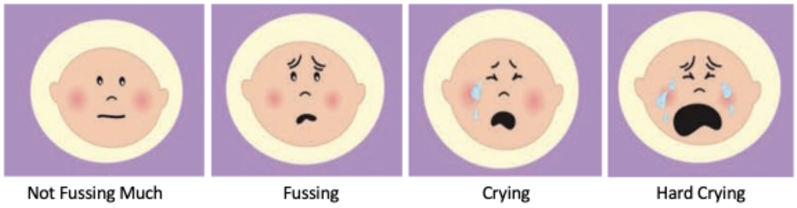

```{r chunk_knit_settings, include=F}

set.seed(42)
knitr::opts_chunk$set(echo = FALSE, message = FALSE, warning = FALSE, cache.extra = knitr::rand_seed, fig.pos='p', out.extra = "")
options(scipen = 999) # disable scientific notation


```

```{r libraries}
# note, make sure {plyr} is installed: install.packages("plyr")

library(pacman)
p_load(
  here,
  RColorBrewer,
  tidyverse,
  kableExtra,
  ggplot2,
  ggpubr,
  ggrepel,
  patchwork,
  gghighlight
)

# set this variable to TRUE to run the full analysis script, otherwise the Rmd will knit with stored results from the most recent run
full_run_of_analysis_script <- TRUE

if (full_run_of_analysis_script == TRUE) {
  source(here("analysis", "analysis.R"))
} else {
  load(here::here("results", "analysis.RData"))
}

```

```{r convenience_functions}
# functions for formatting stats in .rmd knit


# rounds to 2 or 3 decimal places
r0 <- function(num) {format(round(num, 0), nsmall = 0)}
r2 <- function(num) {format(round(num, 2), nsmall = 2)}
r3 <- function(num) {format(round(num, 3), nsmall = 3)}

# formats to percentage
p <- function(num) {paste0((100*(num)) %>% r2, "%")}

# format p-values
fp <- function(num) {
  if (num < .0001) {
    return("< .0001")
  } else if (num < .001) {
    return("< .001")
  } else if (num < .01) {
    return(paste0("= ", round(num, digits = 3)))
  } else {
    return(paste0("= ", round(num, digits = 2)))
  }
}

f <- function(num) {format(num, big.mark = ",")}


themecolors = c('mediumpurple3','yellowgreen')

```


\raggedright
\LARGE
\textbf{Ecological momentary assessment reveals causal effects of music enrichment on infant mood}

\vspace{0.1in}

\justifying
\normalsize
Eun Cho^1,$^{\wedge}$,$\ast$^ , Lidya Yurdum^1,2,$^{\wedge}$,$\ast$^, Ekanem Ebinne^1^, Courtney B. Hilton^3^, Estelle Lai^3^, Mila Bertolo^1,4,5^, Pip Brown^3^, Brooke Milosh^6^, Haran Sened^7^, Diana I. Tamir^7^, and Samuel A. Mehr^1,3,$\ast$^

\small
^1^Child Study Center, Yale University, New Haven, CT 06520, USA.  
^2^Department of Psychology, University of Amsterdam, Amsterdam 1018WT, Netherlands.  
^3^School of Psychology, University of Auckland, Auckland 1010, New Zealand.  
^4^Centre for Research in Brain, Language and Music, McGill University, Montréal, QC H3G 2A8, Canada.  
^5^Integrated Program in Neuroscience, McGill University, Montréal, QC H3A 1A1, Canada.  
^6^Donald and Barbara Zucker School of Medicine at Hofstra/Northwell, Hempstead, NY 11549, USA.   
^7^Department of Psychology, Princeton University, Princeton, NJ 08544, USA.

$^{\wedge}$These authors contributed equally.

\*Corresponding authors. E-mails:
[eun.cho@yale.edu](mailto:eun.cho@yale.edu){.email},
[lidya.yurdum\@yale.edu](mailto:lidya.yurdum@yale.edu){.email},
[sam\@auckland.ac.nz](mailto:sam@auckland.ac.nz){.email}

\bigskip

```{=tex}
\normalsize
\begin{mdframed}[backgroundcolor=gray!20]
Music appears universally in human infancy with self-evident effects: as many parents know intuitively, infants love to be sung to. The long-term effects of parental singing remain unclear, however. In an offset-design exploratory 10-week randomized trial conducted in 2023 ($N = 110$ families of infants, $M_{age} = 3.67$ months, 53\% female, 73\% White), the study manipulated the frequency of infant-directed singing via a music enrichment intervention. Results, measured by smartphone-based ecological momentary assessment (EMA), show that infant-directed singing causes general post-intervention improvements to infant mood, but not to caregiver mood. The findings show the feasibility of longitudinal EMA (retention: 92\%; EMA response rate: 74\%) of infants and the potential of longer-term and higher-intensity music enrichment interventions to improve health in infancy.

\textbf{Keywords:} music, infancy, parenting, infant-directed song, ecological momentary assessment, EMA
\end{mdframed}
```

\linenumbers
\bigskip

# Introduction

Decades of research have demonstrated the profound impact of the quality of early life experiences on lifelong physical and mental health [@Fries2005; @Shonkoff2012]. Building on Bowlby's [-@Bowlby1969] work on attachment, evidence from a wide variety of approaches and across diverse populations shows that consistent warmth, care, and responsiveness provided by caregivers is a key feature of healthy caregiving and positive infant-caregiver relationships [@Schore2005; @Stams2002]. 

Children face very different chances of receiving the benefits of a caring and nurturing infant-caregiver relationship, however. Factors related to risk and resilience, such as caregiver characteristics (e.g., age, sex, personality, marital status), cultural background, and socioeconomic circumstances, together mediated by differential access to resources and opportunities, interact to shape the variability in early life experiences [@Roubinov2017]. Moreover, contextual factors, such as poor marital relationship quality [@Dennis2006] and inadequate social support [@Reid2015], are associated with increased risk of postpartum depression, affecting caregiver responsiveness and sensitivity towards infants [@Feldman2009].

The high degree of variability in early home environments presents an opportunity to improve outcomes for young infants and their families. In particular, simple, low-cost, and low-tech interventions that involve only modest adjustments to infant care practices hold particular promise given their ease of uptake. For example, increasing early skin-to-skin contact (e.g., kangaroo care) has demonstrated numerous health benefits for both premature and full-term infants worldwide [@Feldman2014; @Moore2012]. In this paper, we report an exploratory randomized trial of a high-potential but relatively unexplored type of enrichment: singing interventions for caregivers of young infants. 

Music permeates the early lives of infants, particularly through their interactions with caregivers [e.g., @Trehub2006; @Mehr2017a]. Caregivers universally sing to their infants in the course of child-rearing [@Mehr2019; @Singh2023], throughout infancy [@Yan2021], and regardless of family socioeconomic status [@Mehr2014; @Custodero2003; @Fancourt2018b]. Such infant-directed singing has robust cross-cultural regularities [@Hilton2022a; @Yurdum2023; @Mehr2019], including multimodal features that combine voice, touch, eye contact, and movement, which infants may reciprocate via visual attention, cooing, smiling, and moving their hands and legs [@Malloch2009]. These interactive behaviors may support a variety of communicative functions [@Trehub2019; @Mehr2021], including signaling social information [@Mehr2016; @Mehr2017c] or parental investment [@Kotler2019; @Mehr2017a; @Mehr2017b], enhancing social bonds [@Fancourt2018c], and promoting meaningful social interactions in families [@Lense2022; @Malloch1999].

It may be unsurprising, then, that music in general, and infant-directed singing in particular, have profound effects on infant mood and well-being. Infants, who are notoriously poor at emotional self-regulation, rely heavily on their caregivers; and infant-directed singing is effective in regulating infant mood and arousal on a short-term basis. For example, after a still-face procedure, parent-produced familiar infant-directed songs reduced infant distress and arousal levels more effectively than speech [@Cirelli2020b]. Similarly, in an open-ended listening task, infants listened to singing for more than twice as long before initiating sustained crying, relative to speech listening [@Corbeil2016]. While familiar songs accelerate infants’ recovery from distress [@Cirelli2020b], even unfamiliar, foreign lullabies calm infants, as measured by heart rate, electrodermal activity, and pupillometry [@Bainbridge2021]. 

The benefits of early musical engagement may extend beyond infants to caregivers themselves. Music may aid in the regulation of caregivers’ own arousal levels [@Cirelli2020a], reduce caregiving-related stress [@Cho2021], or contribute to positive home environments [@Byrn2010]. Moreover, active musical engagement has been proposed to foster communication, emotional bonding, and a sense of security and attachment between caregivers and infants [@Fancourt2018c; @Gerry2012; @Persico2017; @Steinberg2021]. Any of these may well promote well-being in caregivers alongside that of their infants. 

Singing therefore has potential as an enrichment intervention, as its short-term effects could in principle work cumulatively, leading to improved health outcomes in infants and caregivers. Only a few longitudinal experiments have tested this possibility. For instance, year-long participation in parent-child music enrichment programs led to enhanced quality of parent-child interactions [@Smith2024]. Additionally, 10-week group singing programs have reduced both psychological and biological markers of depression, anxiety, and stress, while also strengthening bonds between parents with postnatal depression and their infants [@Fancourt2018a; @Perkins2018].

Here, we report a 6-week randomized trial of young infant-caregiver dyads, wherein we experimentally manipulated the frequency of infant-directed singing via a music enrichment intervention. We measured outcomes primarily with smartphone-based ecological momentary assessment (EMA), a method that samples infant behavior in real time via brief, repeated-measures surveys that caregivers complete daily at random intervals [e.g., @deBarbaro2023; @Franchak2019]. This approach provides comprehensive snapshots of highly fluctuating family dynamics and routines over time, minimizing parent recall bias (a vulnerability of prior music intervention studies) and enhancing ecological validity [@vandenHeuvel2021; @Stone2007].

\clearpage
```{r sample size calculations for miph}

# 7 participants were excluded post hoc from miph for low response rates, one dropped out before providing any data
miph_excluded <- dat_full %>% 
  filter(cohort == "miph" & total_percentage_answered < .50) %>% 
  dplyr::select(miph_id) %>% 
  distinct() %>% 
  nrow()

# 1 participant was excluded post hoc from miph-kiwi for a low response rate. Another dropped out and is hidden from the data (MIPH-192818)
kiwi_excluded <- dat_full %>% 
  filter(cohort == "kiwi" & total_percentage_answered < .50) %>% 
  dplyr::select(miph_id) %>% 
  distinct() %>% 
  nrow()

total_excluded <- miph_excluded + kiwi_excluded 

```


```{r demographics table, echo=FALSE, results='asis'}
kable(table1,
      format = "latex",
      booktabs = TRUE,
      linesep = "",
      longtable = TRUE,
      col.names = c("Characteristic"," ","n","% of sample")
) %>% 
  kable_styling(font_size = 6,
                full_width = F) %>%
  kableExtra::footnote(
    general_title = "Table 1 | Demographic characteristics of the sample. ",
    general = "Participants in New Zealand reported their household income in New Zealand dollars, so their responses have been converted to the approximate equivalent US-dollar category. The US-based and New Zealand-based versions of the demographics surveys included slightly different race labels, in line with local guidelines. For simplicity, we have combined the (US-based) category ``White''  and (New Zealand-based) category ``European/New Zealand European''.",
    footnote_as_chunk = TRUE,
    title_format = "bold",
    escape = FALSE,
    threeparttable = TRUE
  ) %>% 
  collapse_rows(c(1,2))
```

# Method

## Participants

All participants provided informed consent under a protocol approved by the Yale University Institutional Review Board (protocol #2000035858). We advertised the study via in-person visits to baby fairs, distribution of flyers at local daycare centers, preschools, and delivery hospitals, and an announcement on public radio in New Haven, Connecticut. Online recruitment efforts targeted social media groups for expecting and new parents, along with online communities related to early childhood education. The inclusion criteria required participants to have a smartphone, to communicate and complete surveys in English, and to be a primary caregiver of the focal infant. Participants were primarily located in the United States and New Zealand (see Table 1), but as the study took place entirely online, there were no geographical constraints. 

Of the 120 participants initially recruited, two withdrew from the study due to time constraints. Eight <!-- this number not generated procedurally as the participants were manually removed based on the stated criterion --> participants were excluded due to low completion rates, having responded to fewer than 50% of EMA pings either for two consecutive weeks during the study period or by the end of the study (an exclusion criterion determined before data collection began). This resulted in a final sample size of `r demographics$total$n`, indicating a retention rate of 91.7%. We report information about the excluded participants in Supplementary Text 1. 

While we aimed to recruit only infants under 6 months of age, considering the significant role of early parent-infant interactions on subsequent development and well-being, recruitment challenges led us to include some older infants. The sample included a small number of infants between 6 and 9 months of age, but is skewed to include more young infants than old ones (see Supplementary Figure 1 for a histogram of infant ages). The participating infants were, on average, `r (demographics$total$babyAge$mean/30) %>% r2` months old at the start of the study (range: `r (demographics$total$babyAge$min/30) %>% r2` - `r (demographics$total$babyAge$max/30) %>% r2` months, interquartile range: `r (demographics$total$babyAge$iqr/30) %>% r2` months). Five infants were born pre-term (i.e., more than 3 weeks before their due date)<!-- This statistic is generated with `r demographics$total$preterm["Early (more than 3 weeks before the due date)"]`-->, and `r demographics$total$babySex["Female"]` of the infants were female (`r round( (demographics$total$babySex["Female"]/demographics$total$n)*100,1)`%). We did not collect medical information about the infant, as our inclusion criteria were broad. 

Caregivers were predominantly mothers (Mean age: `r demographics$total$parentAge %>% round(.,1)` years; `r demographics$total$parentSex["Female"]` female, `r demographics$total$parentSex["Male"]` male), and were mostly White, highly educated, and socioeconomically advantaged (see Table 1 for demographics). Most participants had some degree of musical training; only 18 participants reported having had no formal musical training (see Supplementary Table 1). At three points during the study, caregivers reported how they split caregiving with their partner or other adults (including daycare) on a typical day. Most caregivers (*n* = `r demographics$total$primary_caregiver`) reported providing at least 50% of childcare at all three time points. 

Participant incentives included digital gift cards, a baby songbook, and baby clothing (a total value of approximately US\$70), distributed over the course of the study. We also informed caregivers at the outset of the study that they would receive a personalized report summarizing their survey responses at the end of the study. This approach, inspired by gamified citizen science [e.g., @Long2023; @Liu2023], served as an additional motivation for study completion. An example report is in Supplementary Figure 2.

## Study structure 

We used an offset randomized design, with participants assigned to either a manipulation (*n* = `r dat[dat$condition == "SingFirst",]$miph_id %>% unique %>% length`) or control group (*n* = `r dat[dat$condition == "SingSecond",]$miph_id %>% unique %>% length`). The main portion of the study was six weeks long (Figure 1), with a pre-test period (week 1), a four-week intervention period (weeks 2-5), and a post-test period (week 6). Participation continued for four additional weeks following the post-test, to provide an identical intervention period for the control group, so as to avoid biases stemming from group assignment. Assignment was fully random except for a few participants whose initial random assignment created an imbalance across the two groups. EMA data were collected throughout the trial (see *Measures*). Data collection took place from February to December 2023.

```{r figure 1, echo=FALSE, fig.cap="\\textbf{Figure 1 | Structure of the experiment.} We conducted an offset-design randomized trial with a one-week pre-test, a four-week intervention, and a one-week post-test (see the areas highlighted in green). This main study period was followed by four further weeks of study participation, to accommodate the offset intervention period (for the control group). The left and right columns indicate the study flow for the manipulation and control groups, respectively. Both groups received the same number of EMA pings and followed identical procedures, except during the intervention period (weeks 2-5), during which the manipulation group participated in the music enrichment intervention along with their daily EMA pings, while the control group only completed the EMA pings and had no intervention.", out.width = '90%',fig.align = 'center'}
knitr::include_graphics(here("viz/figure1.png"))
```

The study began with a one-on-one onboarding video call, where a designated researcher provided an overview of the study, guided participants in configuring their smartphones to receive EMA pings, and answered any questions. Participants were required to be physically present with their infants during the onboarding session to safeguard against fraudulent participation, a common concern in online developmental studies [@Perkel2020]. The same researcher continued to serve as the participant's point of contact throughout the rest of the study.

## Measures

The primary measures of infant and caregiver health were collected via EMA. We used a varied ping schedule, where caregivers received three EMA surveys per day during the pre-test (week 1) and post-test (week 6), delivered at randomly selected times in the morning, afternoon, and evening; and one EMA survey per day at all other times during the study, delivered at a randomly selected time during waking hours. In total, caregivers received 98 EMA surveys across the 10 weeks of the study. We did not require a minimum time between responses, so as to maximize the amount of data we could analyze. EMA data collection was conducted either via The Person Project, a smartphone app developed by authors H.S. and D.T; or via Qualtrics surveys accessed via URLs in text messages, distributed with Inclivio (https://inclivio.com). Complete details about EMA methods are in Supplementary Text 2.

The EMA surveys measured characteristics of infant and caregiver health in the 2-3 hours prior to the ping, including 12 items on (1) *infant mood*, measured by valence and arousal; (2) *infant distress and recovery*, assessed through a pictorial scale of infant fussiness [@Adams2019], and details on soothing techniques and duration for recovery; (3) *caregiver mood and stress*, measured by self-assessed valence, impact, and rationality using the 3D Mind Model approach to mental state assessment [@Thornton2020], along with self-reported levels of caregiving-related stress; and (4) *musical behavior*, measured by the frequency of caregivers’ engagement with focus behaviors (i.e., singing and music listening). Every ping included an item asking whether the parent was with the infant during the 2-3 hours prior to the ping. If the parent answered "No", then no items were presented concerning the infant's state (see Supplementary Text 3 for detail about this procedure and the full text of the EMA surveys). We also included questions concerning the previous day, such as the estimated frequency of infant-directed singing, the frequency of infant night waking, and the duration taken to fall back asleep. During the pre-test and post-test, these previous-day questions were only displayed once per day. The full text of the EMA surveys is in Supplementary Text 3.

We also collected data in four longer-form surveys spread throughout the study, for analysis in a different paper comparing EMA responses to retrospective surveys; they are not reported here.

## Music enrichment intervention

The goal of the intervention was to increase the frequency of infant-directed singing in daily life while also expanding caregivers' repertoire of songs. We aimed to do so by teaching participants new songs to sing at home and providing materials designed to encourage more singing, in general, in the course of their caregiving. We did not collect data regarding the exact content or acoustic features of songs caregivers chose to sing to their infants, as we were interested in the effects of increased singing in whatever form caregivers felt was appropriate.

During the intervention, participants were given access to six instructional videos of unfamiliar songs presented in karaoke style, with lyrics synchronized to a bouncing ball indicating the rhythm (all videos are available at https://github.com/themusiclab/musical-babies). These were displayed to participants either in The Person Project app or on YouTube (i.e., at private URLs), depending on the type of EMA caregivers used (see Supplementary Text 2). Three videos were sent at the start of the intervention, with an additional three delivered halfway through. The songs were sourced from vintage songbooks and online archives of folk songs for children, then adapted for simplicity and ease of singing, especially for caregivers with limited music training. This process involved rewriting and arranging lyrics and melodies. The songs were recorded and produced by members of the research team who had extensive experience in early childhood music education (E.C., E.E., and S.A.M.). 

Additionally, participants received an infant-friendly songbook of their choice from a provided list (i.e., the Ditty Bird Musical Book series, Cali's Books series), delivered to their homes at the outset of the intervention. These books featured infant-pressable buttons that activated song playback, accompanied by vibrant illustrations and lyrics. 

Last, to further motivate caregivers to sing more to their infants, we sent weekly email newsletters to participants in the manipulation group during the intervention. The newsletters introduced ideas to incorporate singing into daily caregiving routines; highlighted the significance of singing in infancy; and presented research findings relevant to the benefits of musical parenting, in an easy-to-understand format. The control group received the same newsletters in the offset intervention period, but did not receive any newsletters during the main intervention.


To sustain participants’ engagement over the four-week intervention, the research team maintained regular communication with participants via text messages and emails, providing encouragement and promoting active involvement. Caregivers were not discouraged from singing outside of the intervention period; the intervention should be understood as supplementing existing levels of singing in the home, as opposed to suppressing such behaviors at non-intervention periods or in the control group.

```{r include=FALSE}
compliance_by_phase_dat %>% 
  mutate(high_freq = ifelse(studyPhase %in% c(1,3), 1,0)) %>% 
  group_by(high_freq) %>% 
  summarise(mean = mean(phaseCompletionRate))
```

## Compliance

Participants responded to a median of `r median_pings` out of 98 scheduled pings, for an overall response rate of `r ((compliance_total_dat[compliance_total_dat$total_percentage_answered >= .5,]$total_percentage_answered %>% mean())*100) %>% round(.,1)`%, with a higher rate outside of the pre- and post-test periods (i.e., when only receiving one EMA ping per day; `r ((compliance_by_phase_dat %>% filter(studyPhase %in% c(2,4)) %>% pull(phaseCompletionRate) %>% mean)*100) %>% round(.,1)`%) than during the pre- and post-test periods (i.e., when receiving three EMA pings per day; `r ((compliance_by_phase_dat %>% filter(studyPhase %in% c(1,3)) %>% pull(phaseCompletionRate) %>% mean)*100) %>% round(.,1)`%). This compliance rate is comparable to those reported in other infant EMA studies, including one-week studies with intensive daily pings [@deBarbaro2023; @Wenze2023; @Franchak2019] and longitudinal studies lasting up to 16 weeks with less intensive pings [@Allen2018; @Franchak2024; @Corpuz2023]. We then fit linear models to test whether any demographic variables predicted compliance, using a bootstrap procedure with 1000 resamples to obtain robust estimates of the model coefficients. 

Participants' response rates were unrelated to infant age at the start of the study (*p* `r cohort_compare$compliance_by_age$p.value[2] %>% fp`), total income (*p* `r cohort_compare$compliance_by_income$p.value[2] %>% fp`), number of siblings (*p* `r cohort_compare$compliance_by_sibling_num$p.value[2] %>% fp`), or the caregivers' scores on a postpartum depression inventory [@Cox1987; *p* `r cohort_compare$compliance_by_epds$p.value[2] %>% fp`]. The proportion of unanswered pings was slightly higher in the control group, although this difference did not reach significance at pre-test (*p* `r cohort_compare$compliance_by_condition_pretest %>% filter(term=="conditionSingSecond") %>% pull(p.value) %>% fp`), intervention (*p* `r cohort_compare$compliance_by_condition_intervention %>% filter(term=="conditionSingSecond") %>% pull(p.value) %>% fp`), or post-test (*p* `r cohort_compare$compliance_by_condition_posttest %>% filter(term=="conditionSingSecond") %>% pull(p.value) %>% fp`). Given the comparable levels of missingness in the two groups, we assume that nonresponse represents missing data at random and did not attempt to account for missingness in our analyses.

To assess responsiveness to EMA pings, we calculated response latency by subtracting the time of the ping from the time participants opened the survey on their smartphone. The median response latency was approximately `r latency %>% round(.,0)` minutes (high intensity weeks = `r hifreq_latency %>% r0`; low intensity weeks = `r lowfreq_latency %>% r0`); this analysis was only available for participants whose pings were distributed by text message. A mixed-effects time-series model that accounted for autoregression across the 6 weeks of the study (with data averaged per day when multiple datapoints were available) showed that latency increased with infant age ($\beta$ = `r latency_model %>% filter(term=="current_age") %>% pull(estimate) %>% r2`, *SE* = `r latency_model %>% filter(term=="current_age") %>% pull(std.error) %>% r2`, *p* `r latency_model %>% filter(term=="current_age") %>% pull(p.value) %>% fp`).

# Results

## Music enrichment increases the frequency of infant-directed singing

We began by asking whether the intervention worked; namely, whether we succeeded in increasing the frequency of infant-directed singing in the manipulation group, relative to the control group. Two EMA items addressed this question, in different ways.

First, every EMA ping included an item asking caregivers whether they had sung to their infant in the preceding 2-3 hours. They could respond "Yes" or "No"; the question was only asked of caregivers who reported having been with their infant in the previous 2-3 hours (`r ((dat %>% filter(EMA_wereYouWithBaby == "Yes") %>% nrow() / nrow(dat))*100) %>% round(.,1)`% of all available data, see Measures). We dropped data where the caregiver indicated in the same EMA ping that their infant was sick (`r ((dat %>% filter(EMA_sickBaby == "Yes") %>% nrow() / nrow(dat))*100) %>% round(.,1)`% of data). Here and throughout, we computed weekly average scores using all available data from each participant.

Consistent with previous research using daylong audio recordings from infants’ home environments [@Hippe2024; @Lerma-Arregoces2024; @Mendoza2021], music frequently featured in infants' and caregivers' lives even prior to the intervention. At pre-test, caregivers reported having sung to their infants in the previous  2-3 hours in `r round(singing_analyses$base_rates$singing$mean *100,1)`% of surveys (*SD* = `r (singing_analyses$base_rates$singing$sd*100) %>% round(.,1)`%). Caregivers also reported often playing recorded music to their infants (*M* = `r (singing_analyses$base_rates$musicRecorded$mean*100) %>% round(.,1)`%, *SD* = `r (singing_analyses$base_rates$musicRecorded$sd*100) %>% round(.,1)`%) and playing music for their own enjoyment (*M* = `r (singing_analyses$base_rates$musicForSelf$mean*100) %>% round(.,1)`%, *SD* = `r (singing_analyses$base_rates$musicForSelf$sd*100) %>% round(.,1)`%).

The intervention caused a clear increase in the frequency of infant-directed song (Figure 2, left panel), with no difference between groups at pre-test (proportion of "Yes" responses in manipulation group: *M* = `r singing_analyses$hourly_singing_check$SingFirst$mean[[1]] %>% round(.,2)`, *SD* = `r singing_analyses$hourly_singing_check$SingFirst$sd[[1]] %>% round(.,2)`; in control group: *M* = `r singing_analyses$hourly_singing_check$SingSecond$mean[[1]] %>% round(.,2)`, *SD* = `r singing_analyses$hourly_singing_check$SingSecond$sd[[1]] %>% round(.,2)`; Wilcoxon Rank-Sum Test, *W* = `r singing_analyses$hourly_singing_check$compare_conditions_pretest$statistic`, *p* `r singing_analyses$hourly_singing_check$compare_conditions_pretest$p.value %>% fp`), and a large (*d* = `r (((singing_analyses$hourly_singing_check$SingFirst$mean[[6]] -singing_analyses$hourly_singing_check$SingSecond$mean[[6]])) / mean(c(singing_analyses$hourly_singing_check$SingFirst$sd[[6]], singing_analyses$hourly_singing_check$SingSecond$sd[[6]]))) %>% round(.,2)`), statistically significant difference at post-test (proportion of "Yes" responses in manipulation group: *M* = `r singing_analyses$hourly_singing_check$SingFirst$mean[[6]] %>% round(.,2)`, *SD* =  `r singing_analyses$hourly_singing_check$SingFirst$sd[[6]] %>% round(.,2)`; in control group: *M* = `r singing_analyses$hourly_singing_check$SingSecond$mean[[6]]%>% round(.,2)`, *SD* = `r singing_analyses$hourly_singing_check$SingSecond$sd[[6]] %>% round(.,2)`; Wilcoxon Rank-Sum Test, *W* = `r singing_analyses$hourly_singing_check$compare_conditions_posttest$statistic`, *p*  `r singing_analyses$hourly_singing_check$compare_conditions_posttest$p.value %>% fp`). Note that during post-test, caregivers were no longer actively being encouraged to sing more to their infants: week 5 was the last week of the intervention. The effect of the intervention therefore persisted for at least one week beyond the intervention itself. 

A mixed-effects time-series model that accounted for autoregression across the 6 weeks of the study (with data averaged per day when multiple datapoints were available) showed a significant group-by-time interaction ($\beta$ = `r singing_analyses$hourly_singing_check$autoregression[4,3] %>% as.numeric %>% r2`, *SE* = `r singing_analyses$hourly_singing_check$autoregression[4,4] %>% as.numeric %>% r2`, *p* `r singing_analyses$hourly_singing_check$autoregression[4,7] %>% as.numeric %>% fp`). These effects were specific to infant-directed singing, as we did not find comparable interaction effects for other music-related variables that were also reported in the same EMA surveys, such as playing recorded music for the infant ($\beta$ = `r singing_analyses$hourly_music_check$self$autoregression[4,3] %>% as.numeric %>% r2`, *SE* = `r singing_analyses$hourly_music_check$self$autoregression[4,4] %>% as.numeric %>% r2`, *p* `r singing_analyses$hourly_music_check$self$autoregression[4,7] %>% as.numeric %>% fp`); or caregivers' personal music listening ($\beta$ = `r singing_analyses$hourly_music_check$recorded$autoregression[4,3] %>% as.numeric %>% r2`, *SE* = `r singing_analyses$hourly_music_check$recorded$autoregression[4,4] %>% as.numeric %>% r2`, *p* `r singing_analyses$hourly_music_check$recorded$autoregression[4,7] %>% as.numeric %>% fp`) in the 2-3 hours preceding the EMA ping. 

```{r fig2, fig.cap="\\textbf{Figure 2 | Music enrichment increases the frequency of infant-directed singing.} The plots depict responses to two items: ``Did you sing to [baby] in the last 2-3 hours?'', where ``[baby]'' was replaced by the infant's name (left panel), asked up to three times per day with response options ``Yes'' or ``No''; and ``If you had to guess, how many times did you sing to [baby] yesterday?'' (right panel), asked once per day with response options ranging from ``1'' to ``8 or more times''. There was a sharp increase in infant-directed singing for the manipulation group, but not the control group, as measured by both items; the increase persisted through the full intervention and was maintained in the post-test week. The tick marks on the $x$-axis indicate the study week; weeks 1 and 6 correspond to pre- and post-test, respectively, while weeks 2 through 5 span the intervention period. Note that for ease of visualisation, here we plot weekly averages (points) and their corresponding standard errors of the mean (error bars), without accounting for temporal autocorrelation in responses over time. As such, the SEM values may be overestimating the precision of each estimate.", warning=F, message=F}
weekly_freq <- dat %>% 
  filter(daynumber < 42) %>% 
  mutate(week = ceiling((daynumber+1)/ 7)) %>% 
  dplyr::select(condition,miph_id,daynumber,week,EMA_babySingHowManyTimes) %>%
  drop_na()%>%
  group_by(condition, week, miph_id) %>%
  summarise(avg_singing_frequency = mean(EMA_babySingHowManyTimes)) %>%
  group_by(condition, week) %>% 
  summarise(mean_avg_singing_frequency = mean(avg_singing_frequency),
            n= n(),
            sd = sd(avg_singing_frequency),
            se = sd/sqrt(n)
  ) %>%
  ungroup() %>% 
  mutate(week_coordinate = case_when(week == 1 ~ 6, 
                                     week == 2 ~ 13, 
                                     week == 3 ~ 20, 
                                     week == 4 ~ 27,
                                     week == 5 ~ 34,
                                     week == 6 ~ 41)) 


## singing percentage plot
weekly_prop <- dat %>% 
  filter(EMA_wereYouWithBaby == "Yes" & EMA_sickBaby == "No") %>% 
  group_by(cohort, condition, miph_id, week) %>% 
  summarise(sangPercentage = mean(EMA_sungToBabyLastHour == "Yes", na.rm = TRUE),
            musicForSelfPercentage = mean(EMA_musicForOwnEnjoyment == "Yes", na.rm = TRUE),
            musicRecordedPercentage = mean(EMA_playedRecordedMusic == "Yes", na.rm = TRUE)) %>% 
  filter(week < 7) %>%
  group_by(week, condition) %>%
  summarise(mean = mean(sangPercentage),
            sd = sd(sangPercentage),
            n = n(),
            se = sd/sqrt(n)) 

p1 <- ggplot(data = weekly_prop, 
             aes(x = week, y = mean, 
                 group = condition, colour = condition)) +
  theme_classic() +
  geom_line(data = weekly_prop, geom='line',
            aes(x = week, 
                y = mean, 
                group = condition))+
  geom_errorbar(data = weekly_prop,
                aes(x = week, 
                    y=mean,
                    ymin=mean-se,
                    ymax=mean+se), 
                width = .2, 
                group = condition,
                position = position_dodge(0.05)) +
  theme(legend.position="bottom",
        axis.title.x = element_blank())+
  labs(x ="Week", y = "Proportion responding 'Yes'") +
  guides(color=guide_legend(title="Group", 
                            override.aes=list(shape = 19, size=8, alpha=1, linetype = "blank")))+ 
  scale_x_continuous(breaks=c(1,2,3,4,5,6),
                     labels = c("", "","","","", ""),
                     name="Study Phase")+
  # scale_y_continuous(labels = function(x) paste0(x, "%")) + # Add percent sign 
  scale_color_manual(values=themecolors, 
                     labels = c("Manipulation", "Control")) +
  geom_point(data = weekly_prop, 
             aes(x = week, y = mean, group = week)) +
  ggtitle("Singing to infant in 2-3 hours prior to ping")+  
  theme(plot.title = element_text(size = 9, face="bold"))+
  annotate("text", x = 3.5, y = -.13, label = "Intervention",size=3) +   
  annotate("text", x = 1, y = -.13, label = "Pre-test",size=3) +  
  annotate("text", x = 5.9, y = -.13, label = "Post-test",size=3) +
  coord_cartesian(ylim = c(0, 1), clip = "off")+
  geom_segment(aes(x = 2, y = -.12, xend = 2.5, yend = -.12), show.legend = F, color =  "grey27")+
  geom_segment(aes(x = 4.5, y = -.12, xend = 5, yend = -.12), show.legend = F, color =  "grey27")+
  geom_segment(aes(x = 2, y = -.12, xend = 2, yend = -.1), show.legend = F, color =  "grey27")+
  geom_segment(aes(x = 5, y = -.12, xend = 5, yend = -.1), show.legend = F, color =  "grey27") +
  geom_vline(xintercept = 2, linetype="dotted", 
                color = "grey", size=.5) +
  geom_vline(xintercept = 5, linetype="dotted", 
                color = "grey", size=.5)


p2 <- ggplot(data = weekly_freq, 
             aes(x = week, y = mean_avg_singing_frequency, 
                 group = condition, colour = condition)) +
  theme_classic() +
  geom_line(data = weekly_freq, geom='line',
            aes(x = week, 
                y = mean_avg_singing_frequency, 
                group = condition))+
  geom_errorbar(data = weekly_freq,
                aes(x = week, 
                    y=mean_avg_singing_frequency,
                    ymin=mean_avg_singing_frequency-se,
                    ymax=mean_avg_singing_frequency+se), 
                width = .1, 
                group = condition) +
  theme(legend.position="bottom",
        axis.title.x = element_blank())+
  guides(color=guide_legend(title="Group", 
                            override.aes=list(shape = 19, size=8, alpha=1, linetype = "blank")))+ 
  scale_x_continuous(breaks=c(1,2,3,4,5,6),
                     labels = c("", "","","","", ""),
                     name = "Study Phase")+
  scale_y_continuous(breaks=c(1,2,3,4,5,6,7,8),
                     labels = c(c(1:7),"8 (or \nmore)"),
                     name = "Number of times per day")+
  scale_color_manual(values=themecolors, 
                     labels = c("Manipulation", "Control")) +
  geom_point(data = weekly_freq, 
             aes(x = week, y = mean_avg_singing_frequency, group = week)) +
  ggtitle("Total estimated singing on previous day")+  
  theme(plot.title = element_text(size = 9, face="bold"))+   
  annotate("text", x = 3.5, y = -1, label = "Intervention",size=3) +   
  annotate("text", x = 1, y = -1, label = "Pre-test",size=3) +  
  annotate("text", x = 6, y = -1, label = "Post-test",size=3) +  
  coord_cartesian(ylim = c(0, 8), clip = "off")+
  geom_segment(aes(x = 2, y = -1, xend = 2.5, yend = -1), show.legend = F, color =  "grey27")+
  geom_segment(aes(x = 4.5, y = -1, xend = 5, yend = -1), show.legend = F, color =  "grey27")+
  geom_segment(aes(x = 2, y = -1, xend = 2, yend = -.85), show.legend = F, color =  "grey27")+
  geom_segment(aes(x = 5, y = -1, xend = 5, yend = -.85), show.legend = F, color =  "grey27")+
  geom_vline(xintercept = 2, linetype="dotted", 
                color = "grey", size=.5) +
  geom_vline(xintercept = 5, linetype="dotted", 
                color = "grey", size=.5)


combined <- p1 + p2 & theme(legend.position = "bottom") 
combined + plot_layout(guides = "collect")

ggsave(here("./viz", "figure2.png"), width = 8, height = 4.5)
```

Notably, the absolute frequency of infant-directed singing was substantial in the manipulation group: by the last week of the intervention, the proportion of times a caregiver had recently sung to their infant when they received an EMA ping was `r singing_analyses$hourly_singing_check$SingFirst$mean[[5]] %>% r2` -- almost all of the time -- relative to `r singing_analyses$hourly_singing_check$SingSecond$mean[[5]] %>% r2` in the control group.

Second, caregivers reported an estimate of how many times they had sung to their infant on the previous day ("If you had to guess, how many times did you sing to [baby] yesterday?") on an 8-point scale ranging from "1" to "8 or more times". Here too we found a clear effect of the intervention (Figure 2, right panel), with no group-level difference at pre-test (Wilcoxon Rank-Sum Test, *W* = `r singing_analyses$singing_freq$compare_conditions_pretest$statistic`, *p* `r singing_analyses$singing_freq$compare_conditions_pretest$p.value %>% fp`), a significant difference at post-test (Wilcoxon Rank-Sum Test, *W* = `r singing_analyses$singing_freq$compare_conditions_posttest$statistic`, *p* `r singing_analyses$singing_freq$compare_conditions_posttest$p.value %>% fp`), and a significant group-by-timepoint interaction (Mixed-effects time-series model, $\beta$ = `r singing_analyses$singing_freq$autoregression[4,3] %>% as.numeric %>% r2`, *SE* = `r singing_analyses$singing_freq$autoregression[4,4] %>% as.numeric %>% r2`, *p* `r singing_analyses$singing_freq$autoregression[4,7] %>% as.numeric %>% fp`) indicating an estimated average increase of `r ((singing_analyses$singing_freq$autoregression[4,3] %>% as.numeric + singing_analyses$singing_freq$autoregression[3,3] %>% as.numeric)*7) %>% r2` singing episodes per week in the manipulation group (roughly `r (((singing_analyses$singing_freq$autoregression[4,3] %>% as.numeric + singing_analyses$singing_freq$autoregression[3,3] %>% as.numeric)*7)/8*100) %>% round(.,1)`% of the scale per week, for a cumulative total of `r (((((singing_analyses$singing_freq$autoregression[4,3] %>% as.numeric + singing_analyses$singing_freq$autoregression[3,3] %>% as.numeric)*7)/8*100))*6) %>%  round(.,1)`% after the six weeks of intervention). While caregiver reports summarizing the previous day's singing with an integer may not be optimally precise, at the post-test period these effects represented a `r sing_freq_dat[sing_freq_dat$condition == "SingFirst",]$d %>% mean(na.rm=T) %>% r2` unit increase in absolute daily estimates of singing behavior (*SD* = `r sing_freq_dat[sing_freq_dat$condition == "SingFirst",]$d %>% sd(na.rm=T) %>% r2`).

Thus, convergent evidence demonstrates that the intervention succeeded at its primary goal, namely, to experimentally manipulate caregivers' infant-directed singing in daily life.

```{r figure-3AB, echo=FALSE, fig.cap="\\textbf{Figure 3 | Music enrichment alters parent responses to infant fussiness.} In each EMA ping, we asked the parent if their infant was fussy in the previous 2-3 hours; if they answered ``Yes'', then we asked how they attempted to soothe the infant. The left panel illustrates the proportion of responses in the manipulation group for six soothing techniques (of 12 available options; see Supplementary Text 3). Tick marks indicate the study week; weeks 1 and 6 correspond to pre- and post-test, respectively, whereas weeks 2 through 5 span the intervention period. Singing in response to fussiness was the only soothing technique out of 12 that showed a substantive increase in usage from pre- to post-test. This increase was specific to the manipulation group, as shown in the right panel, which rescales the data as a proportion of all responses and averages across the four intervention weeks (weeks 2-5). In the manipulation group, parents used singing in response to fussiness more than half of the time. The points indicate mean scores across the given week(s) and error bars denote standard errors of the mean.",  fig.align = 'center'}

data_ends <- soothing_plot1_data %>% filter(week == 6) %>% 
  mutate(proportion = case_when(method == "Feed" ~ proportion + .05,
                                method == "Bounce/Rock/Walk/Swing" ~ proportion ,
                                TRUE ~ proportion))

p1 <- ggplot(soothing_plot1_data, aes(x = week, y = proportion, color = method, group = method)) +
  geom_line(aes(alpha = (method == "Sing")), show.legend = FALSE) +  # Exclude lines from legend
  geom_line(data = subset(soothing_plot1_data, method == "Sing"), show.legend = FALSE) +  # Exclude highlighted line from legend
  geom_point(size = 1, aes(alpha = (method == "Sing")), show.legend = FALSE) +  # Don't show points in legend
  # guides(color = guide_legend(override.aes = list(size = 4), nrow = 3, byrow = TRUE)) +  # Adjust size in legend guide for better visibility
  scale_alpha_manual(values = c(0.2, 1)) +  # Define alpha scale
  theme_classic() +
  labs(color = "Soothing Method") +
  scale_x_continuous(breaks=c(1,2,3,4,5,6),
                     labels = c("", "","","","", ""))+
  ylab("Proportion") +
  ggtitle('Soothing methods in the manipulation group') +
  theme(plot.title = element_text(size = 8, face = "bold"),
        legend.text=element_text(size=7),
        legend.position = "bottom", 
        legend.box = "horizontal", 
        legend.title = element_blank(),
        axis.title.x = element_blank()) +
  guides(alpha = FALSE)+  # Hide alpha legend
  annotate("text", x = 3.5, y = -.12, label = "Intervention", size=3, color = "grey27") +   
  annotate("text", x = 1, y = -.12, label = "Pre-test",size=3,color = "grey27") +  
  annotate("text", x = 6, y = -.12, label = "Post-test",size=3,color = "grey27") + 
  coord_cartesian(ylim = c(0, 1), clip = "off")+
  expand_limits(x = c(0.5, 6.5))+
  geom_segment(aes(x = 2, y = -.12, xend = 2.5, yend = -.12), show.legend = F, color =  "grey27")+
  geom_segment(aes(x = 4.5, y = -.12, xend = 5, yend = -.12), show.legend = F, color =  "grey27")+
  geom_segment(aes(x = 2, y = -.12, xend = 2, yend = -.1), show.legend = F, color =  "grey27")+
  geom_segment(aes(x = 5, y = -.12, xend = 5, yend = -.1), show.legend = F, color =  "grey27")+
  geom_vline(xintercept = 2, linetype="dotted", 
             color = "grey", size=.5) +
  geom_vline(xintercept = 5, linetype="dotted", 
             color = "grey", size=.5) +
  geom_text_repel(
    aes(label = method),
    data=data_ends,
    size = 2.5,
    direction = "y",
    xlim = c(7.1, NA),
    vjust = -1.55,
    segment.alpha = 0,
    box.padding = .2,
    #point.padding = .4,
    segment.curvature = -0.1,
    segment.ncp = 3,
    segment.angle = 20,
    show.legend=FALSE
  ) 

data_ends2 <- soothing_plot2_data %>% filter(phase == "Post-test\n") %>% 
  mutate(condition_label = case_when(condition == "SingFirst" ~ "Manipulation",
                               condition == "SingSecond" ~ "Control",
                               TRUE~condition))

p2 <- ggplot(soothing_plot2_data, aes(x = factor(phase), y = mean, color = condition, group = condition)) +
  geom_line(show.legend = FALSE) +
  geom_point(size=1, show.legend = FALSE)+
  theme_classic() +
  ylim(0,1)+
  scale_color_manual(values=themecolors,
                     labels = c("Manipulation", "Control"))+
  labs(x = NULL, y = NULL, color = "Condition") +
  guides(color = guide_legend(override.aes = list(size=4))) +
  theme(legend.position="bottom", legend.box = "horizontal", legend.title = element_blank())+
  ggtitle('Proportion of singing as a soothing method \nacross conditions')+
  theme(plot.title = element_text(size = 8, face="bold"),
        legend.text=element_text(size=7),
        axis.text.x = element_text(vjust = 0.1))+
  geom_errorbar(data = soothing_plot2_data,
                aes(x = phase,
                    y=mean,
                    ymin=mean-se,
                    ymax=mean+se),
                width = .1,
                group = condition,
                show.legend = F) +
  expand_limits(x = c(1, 3.9))+
  geom_text_repel(
    aes(label = condition_label),
    data=data_ends2,
    size = 2.5,
    direction = "y",
    vjust = 3,
    segment.size = .7,
    xlim = c(3, NA),
    segment.alpha = 0,
    segment.linetype = "dotted",
    box.padding = .5,
    point.padding = .1,
    segment.curvature = -0.1,
    segment.ncp = 3,
    segment.angle = 20,
    show.legend=FALSE
  )

p1 + p2 

ggsave(here("./viz", "figure3.png"), width = 8, height = 4.5)
```

## Music enrichment increases the use of singing specifically in the context of soothing infants

Given the well-known role of music in soothing or calming infants [e.g., @Bainbridge2021], we wondered whether the intervention had not only general effects on the use of infant-directed singing, but also specific effects in the context of soothing.

It did. In each EMA survey, we asked participants if their infant was fussy in the last 2-3 hours. If so, they indicated all soothing techniques they used in response, from a list of 12 different techniques (e.g., feeding, changing a diaper, shushing, playing recorded music, singing; the full list is in Supplementary Text 3). Parents reported that their infant was fussy (and not sick) in `r ((dat %>% filter(EMA_wereYouWithBaby=="Yes" & EMA_babyFussy == "Yes" & EMA_sickBaby == "No") %>% nrow() / nrow(dat))*100) %>% round(.,1)`.0% of instances.

While the use of most soothing techniques remained more-or-less constant over the course of the study, in the manipulation group there was a large increase in the proportion of time caregivers used singing in response to fussy infants (Figure 3, left panel; pre-test: *M* = `r soothing_method_dat_long %>% filter(week==1 & condition == "SingFirst") %>% pull(EMA_babyHowCalmDown.Sing) %>% mean(na.rm=T) %>% r2`, *SD* = `r soothing_method_dat_long %>% filter(week==1 & condition == "SingFirst") %>% pull(EMA_babyHowCalmDown.Sing) %>% sd(na.rm=T) %>% r2`; average across intervention: *M* = `r soothing_method_dat_long %>% filter(week %in% c(2:5) & condition == "SingFirst") %>% pull(EMA_babyHowCalmDown.Sing) %>% mean(na.rm=T) %>% r2`, *SD* = `r soothing_method_dat_long %>% filter(week %in% c(2:5) & condition == "SingFirst") %>% pull(EMA_babyHowCalmDown.Sing) %>% sd(na.rm=T) %>% r2`; post-test: *M* = `r soothing_method_dat_long %>% filter(week %in% c(6) & condition == "SingFirst") %>% pull(EMA_babyHowCalmDown.Sing) %>% mean(na.rm=T) %>% r2`, *SD* = `r soothing_method_dat_long %>% filter(week %in% c(6) & condition == "SingFirst") %>% pull(EMA_babyHowCalmDown.Sing) %>% sd(na.rm=T) %>% r2`). While singing was the third most frequently used soothing technique among the 12 different techniques (both at pre-test and overall), following movement-based soothing (i.e., picking-up, bouncing, rocking, or swinging) and feeding, singing was the only technique with increased caregiver use as a result of the intervention, an increase of `r as.numeric((soothing_analyses$singing_change$manipulation_change)*100) %>% round(.,0)` percentage points from pre-test to post-test (Wilcoxon Signed Rank Test, *V* = `r soothing_analyses$singing_change$manipulation$statistic`, *p* `r soothing_analyses$singing_change$manipulation$p.value %>% fp`). 

No such increase was observed in the control group, however; there, the singing response stayed relatively flat (Wilcoxon Signed Rank Test, *V* = `r soothing_analyses$singing_change$control$statistic`, *p* `r soothing_analyses$singing_change$control$p.value %>% fp`; Figure 3, right panel). The cross-group difference at post-test was statistically significant (Wilcoxon Rank-Sum Test, *W* = `r soothing_analyses$singing_change$compare_groups$statistic`, *p* `r soothing_analyses$singing_change$compare_groups$p.value %>% fp`). Notably, we did not observe a group-level difference at post-test in the frequency of playing recorded music to infants, indicating that the effect did not reflect a general increase in the use of music to soothe infants (Wilcoxon Rank-Sum Test, *W* = `r soothing_analyses$recorded_music_change$compare_groups$statistic`, *p* `r soothing_analyses$recorded_music_change$compare_groups$p.value %>% fp`). Rather, it was specific to singing.

Thus, music enrichment not only increased the overall use of infant-directed singing in daily life, but specifically changed how caregivers responded to infant fussiness. We note here that no part of the intervention specifically instructed caregivers to use music in the context of soothing; the decision to use music in the context of soothing infants is apparently an intuitive one.

## Infant-directed singing improves infant mood but not caregiver mood

As music has been shown to affect a variety of affect- and arousal-related variables in infants in the short-term [e.g., @Bainbridge2021; @Cirelli2020a; @Cirelli2020b; @Corbeil2016], a key question for this randomized trial is whether such effects are cumulative. Does music enrichment produce lasting effects on infant affect?

To study this question, we focused primarily on caregiver evaluations of infant mood, reported using a sliding scale from Negative (0) to Positive (100). In each EMA survey, caregivers rated their infant's mood during the last 2-3 hours. Caregivers only responded if they had been with their infant during that time. 

Importantly, this item does *not* measure caregivers' perceptions of infants' mood in response to singing. Rather, the item measures perceptions of infant mood *in general*.

To account for participant variability in scale usage, we *z*-scored mood ratings within participants. We then computed a weekly average score for each infant. Consistent with other research showing less frequent crying as infants grow older [@Barr1990], infants showed improvements in mood from pre- to post-test, on average (mean difference = `r baby_tests$mood$all_1_6_change %>% r2`; Wilcoxon Singed Rank Test, *V* = `r baby_tests$mood$all_1_6$statistic`, *p* `r baby_tests$mood$all_1_6$p.value %>% fp`).

These improvements were moderated by manipulation group, however (Figure 4, left panel). At pre-test the two groups did not differ (in *z*-scores, manipulation group: *M* = `r baby_mood_dat_wide %>% filter(condition=="SingFirst") %>% pull(weeklyPos_scaled_1) %>% mean(na.rm=T) %>% r2`, *SD* =  `r baby_mood_dat_wide %>% filter(condition=="SingFirst") %>% pull(weeklyPos_scaled_1) %>% sd(na.rm=T) %>% r2`; control group: *M* = `r baby_mood_dat_wide %>% filter(condition=="SingSecond") %>% pull(weeklyPos_scaled_1) %>% mean(na.rm=T) %>% r2`, *SD* =  `r baby_mood_dat_wide %>% filter(condition=="SingSecond") %>% pull(weeklyPos_scaled_1) %>% sd(na.rm=T) %>% r2`; Wilcoxon Rank-Sum Test, *W* = `r baby_tests$mood$compare_pretest$statistic`, *p* `r baby_tests$mood$compare_pretest$p.value %>% fp`), but at post-test, the intervention had caused a significant difference in infant mood, with the manipulation group approximately `r ((baby_mood_dat_wide %>% filter(condition=="SingFirst") %>% pull(weeklyPos_scaled_6) %>% mean(na.rm=T)) - (baby_mood_dat_wide %>% filter(condition=="SingSecond") %>% pull(weeklyPos_scaled_6) %>% mean(na.rm=T))) %>% r2` standard deviations higher (manipulation group: *M* = `r baby_mood_dat_wide %>% filter(condition=="SingFirst") %>% pull(weeklyPos_scaled_6) %>% mean(na.rm=T) %>% r2`, *SD* = `r baby_mood_dat_wide %>% filter(condition=="SingFirst") %>% pull(weeklyPos_scaled_6) %>% sd(na.rm=T) %>% r2`; control group: *M* = `r baby_mood_dat_wide %>% filter(condition=="SingSecond") %>% pull(weeklyPos_scaled_6) %>% mean(na.rm=T) %>% r2`, *SD* = `r baby_mood_dat_wide %>% filter(condition=="SingSecond") %>% pull(weeklyPos_scaled_6) %>% sd(na.rm=T) %>% r2`; Wilcoxon Rank-Sum Test, *W* = `r baby_tests$mood$compare_posttest$statistic`, *p* `r baby_tests$mood$compare_posttest$p.value %>% fp`). 

A mixed-effects time-series model (using untransformed data and daily averages of individuals' responses when multiple datapoints were available) that accounted for autoregression showed a significant group-by-time interaction ($\beta$ = `r baby_tests$mood$autoregression %>% filter(term=="conditionSingFirst:daynumber") %>% pull(estimate) %>% r2`, *SE* = `r baby_tests$mood$autoregression %>% filter(term=="conditionSingFirst:daynumber") %>% pull(std.error) %>% r2`, *p* `r baby_tests$mood$autoregression %>% filter(term=="conditionSingFirst:daynumber") %>% pull(p.value) %>% fp`). In the manipulation group, each week of intervention was associated with a `r (((baby_tests$mood$autoregression %>% filter(term=="conditionSingFirst:daynumber") %>% pull(estimate)) + (baby_tests$mood$autoregression %>% filter(term=="daynumber") %>% pull(estimate)))*7) %>% r2`-unit increase in the 100-point mood scale for infants in the manipulation group (*p* < .001), or roughly one tenth of a *SD* increase per week of intervention<!-- This statistic is summarized with `r baby_tests$mood$sd_increase %>% r2`-->.

We tested the robustness of this effect by asking whether it repeated in two subsets of the main sample: a first cohort, recruited mainly in the United States from February to June 2023; and a second cohort, recruited mainly in New Zealand from June to December 2023. Mixed-effects time-series models revealed the same expected group-by-time interaction in both the first ($\beta$ = `r baby_tests$mood$miph$autoregression %>% filter(term=="conditionSingFirst:daynumber") %>% pull(estimate) %>% r2`, *SE* = `r baby_tests$mood$miph$autoregression %>% filter(term=="conditionSingFirst:daynumber") %>% pull(std.error) %>% r2`, *p* `r baby_tests$mood$miph$autoregression %>% filter(term=="conditionSingFirst:daynumber") %>% pull(p.value) %>% fp`) and second cohorts ($\beta$ = `r baby_tests$mood$kiwi$autoregression %>% filter(term=="conditionSingFirst:daynumber") %>% pull(estimate) %>% r2`, *SE* = `r baby_tests$mood$kiwi$autoregression %>% filter(term=="conditionSingFirst:daynumber") %>% pull(std.error) %>% r2`, *p* `r baby_tests$mood$kiwi$autoregression %>% filter(term=="conditionSingFirst:daynumber") %>% pull(p.value) %>% fp`).

```{r fig4, fig.cap="\\textbf{Figure 4 | Music enrichment improves infant mood but not caregiver mood.} In each EMA ping, caregivers were asked to report their infant's mood and their own mood during the previous 2-3 hours, both on a 100-point slider anchored at ``Very negative'' and ``Very positive''. We normalized responses within participants to account for individual differences in scale use. While average mood of infants in the two groups did not differ at pre-test, it did at post-test, with significantly more positive mood reports in the manipulation group (left panel). We did not observe the same pattern for caregiver mood (right panel). The half-violins depict the distributions of weekly mean mood ratings from each of the two groups, weighted by participant. The shaded area in the half-violins represent kernel density estimates; the boxplots denote the median (horizontal line), 95\\% confidence interval (notches), and interquartile range (edges of the boxes). The significance stars above the violins denote the between-groups comparison at a given time point. The horizontal bar denotes the significant group-by-time interaction in the time-series model. $^{\\ast}p < 0.05$, $^{\\ast\\ast}p < 0.01$, $^{\\ast\\ast\\ast}p < 0.001$.", warning=F, message=F}


p1 <- ggplot(baby_mood_dat_plot, aes(x = week, y = weeklyPos_scaled, fill = condition)) +
  scale_fill_manual(values = themecolors, labels = c("Manipulation", "Control")) +
  geom_split_violin(nudge = 0.02, 
                    key_glyph = draw_key_point, 
                    width = .5,
                    trim = FALSE) +
  geom_boxplot(aes(fill = interaction(condition, week), group = interaction(condition, week)), 
               width = 0.1, 
               position = position_dodge(width = .3), 
               show.legend = FALSE, 
               outlier.shape = NA, 
               key_glyph = draw_key_point, 
               notch = TRUE, 
               fill = "white",
               color = "black") +  # Set outline color to black
  theme_classic() +
  xlab("") +
  ylab(expression('Infant Mood ('~italic("z")~')'))+
  ylim(-2, 2) +
  annotate("text", x = 2, y = 1.3, label = "**", alpha = 1, size = 4) +
  annotate("text", x = 1, y = 1.4, label = "n.s.", alpha = 1, size = 4) +
  guides(fill = guide_legend(title = "Group", override.aes = list(shape = 19, size = 8, alpha = 1, color = themecolors))) +
  theme(
    legend.position = "right",
    text = element_text(size = 20),
    axis.text = element_text(size = 10),
    axis.title = element_text(size = 10),
    legend.text = element_text(size = 10),
    legend.title = element_text(size = 10),
    plot.background = element_rect(fill = "transparent", colour = "transparent"),
    panel.background = element_rect(fill = "transparent", colour = "transparent"),
    legend.background = element_rect(fill = "transparent", colour = "transparent")
  ) +
  geom_hline(yintercept = 0, linetype = "dashed", color = "black") +
  geom_bracket(xmin = 1, xmax = 2,
               y.position = 1.7,
               label = "***")

  


p2 <- ggplot(parent_mood_dat_plot, aes(x = week, y = weeklyPos_scaled, fill = condition)) +
  scale_fill_manual(values = themecolors, labels = c("Manipulation", "Control")) +
  geom_split_violin(nudge = 0.02, 
                    key_glyph = draw_key_point, 
                    width = .5,
                    trim = FALSE) +
  geom_boxplot(aes(fill = interaction(condition, week), group = interaction(condition, week)), 
               position = position_dodge(width = .3),
               width = 0.1, 
               show.legend = FALSE, 
               outlier.shape = NA, 
               key_glyph = draw_key_point, 
               notch = TRUE, 
               fill = "white",
               color = "black") +  # Set outline color to black
  theme_classic() +
  scale_color_manual(values = themecolors, labels = c("Manipulation", "Control")) +  # Match color scale to fill scale
  theme_classic()+
  xlab("") + 
  ylab(expression('Caregiver Mood ('~italic("z")~')'))+
  ylim(-2, 2) +
  annotate("text", x = 1, y = 1.6, label = "n.s.", alpha = 1, size = 4) +
  annotate("text", x = 2, y = 1.6, label = "n.s.", alpha = 1, size = 4) +
  guides(fill = guide_legend(title = "Group", 
                             override.aes = list(shape = 19, size = 8, alpha = 1, color = themecolors))) +
  theme(
    legend.position = "right",
    text = element_text(size = 15),
    axis.text = element_text(size = 10),
    axis.title = element_text(size = 10),
    legend.text = element_text(size = 10),
    legend.title = element_text(size = 10),
    plot.background = element_rect(fill = "transparent", colour = "transparent"),
    panel.background = element_rect(fill = "transparent", colour = "transparent"),
    legend.background = element_rect(fill = "transparent", colour = "transparent")
  ) +
  geom_hline(yintercept = 0, linetype = "dashed", color = "black")

combined <- p1 + p2 & theme(legend.position = "bottom") 
combined + plot_layout(guides = "collect")

ggsave(here("./viz", "figure4.png"), width = 8, height = 4.5)
```


Caregivers also rated how energetic their infants were in the previous 2-3 hours, using a similar scale to the mood item; we found no corresponding effects on this measure, suggesting the effects of music enrichment are specific to infant mood and do not generalize to infant arousal.

We proceeded by analyzing data concerning caregiver mood, for two reasons. First, improvements to infant mood might well translate to improvements in caregiver mood, since happier infants are easier to look after than fussier ones. Second, a concern with the infant mood result is the potential for contamination in caregiver self-reports: they might erroneously report happier infants when they themselves felt happier. Because this experiment relies on caregiver EMA data, we are unable to directly assess infant mood in isolation from the caregiver.

We addressed these issues with several analyses of caregivers' responses to ratings of their own mood, completed in the same EMA surveys and using the same normalization approach as the infant mood item. In contrast to infant mood, we found no differences between groups at pre-test (Figure 4, right panel; manipulation group: *M* = `r parent_mood_dat_wide %>% filter(condition == "SingFirst") %>%  pull(weeklyPos_scaled_1) %>% mean(na.rm=T) %>% r2`, *SD* = `r parent_mood_dat_wide %>% filter(condition == "SingFirst") %>%  pull(weeklyPos_scaled_1) %>% sd(na.rm=T) %>% r2`; control group: *M* = `r parent_mood_dat_wide %>% filter(condition == "SingSecond") %>%  pull(weeklyPos_scaled_1) %>% mean(na.rm=T) %>% r2`, *SD* = `r parent_mood_dat_wide %>% filter(condition == "SingSecond") %>%  pull(weeklyPos_scaled_1) %>% sd(na.rm=T) %>% r2`; Wilcoxon Rank-Sum Test, *W* = `r parent_tests$compare_baseline_mood_scaled$statistic`, *p* `r parent_tests$compare_baseline_mood_scaled$p.value %>% fp`) or post-test (manipulation group: *M* = `r parent_mood_dat_wide %>% filter(condition == "SingFirst") %>%  pull(weeklyPos_scaled_6) %>% mean(na.rm=T) %>% r2`, *SD* = `r parent_mood_dat_wide %>% filter(condition == "SingFirst") %>%  pull(weeklyPos_scaled_6) %>% sd(na.rm=T) %>% r2`; control group: *M* = `r parent_mood_dat_wide %>% filter(condition == "SingSecond") %>%  pull(weeklyPos_scaled_6) %>% mean(na.rm=T) %>% r2`, *SD* = `r parent_mood_dat_wide %>% filter(condition == "SingSecond") %>%  pull(weeklyPos_scaled_6) %>% sd(na.rm=T) %>% r2`; Wilcoxon Rank-Sum Test, *W* = `r parent_tests$compare_posttest_mood_scaled$statistic`, *p* `r parent_tests$compare_posttest_mood_scaled$p.value %>% fp`). This absence of effect suggests that the effect of music enrichment on caregiver self-reports of infant mood does not erroneously represent an effect on caregiver mood.

Infant mood and caregiver mood were moderately and positively correlated, however (Spearman's rank correlation; *r* = `r parent_tests$baby_parent_corr$estimate %>% r2`, *p* `r parent_tests$baby_parent_corr$p.value %>% fp`), and adding caregiver mood as a predictor to the mixed model regressing condition and day number on infant mood weakened the time-by-group interaction enough that it no longer reached statistical significance (*p* `r baby_tests$mood$autoregression_with_parents %>% filter(term=="conditionSingFirst:daynumber") %>% pull(p.value) %>% fp`). While the correlation between infant and caregiver mood could indicate a true relation between these variables, a response bias, or both, we found no evidence for a difference in the size of the correlation across the manipulation and control groups ($\beta$ = `r parent_tests$baby_parent_corr_compare %>% filter(term=="EMA_adultHowPositive_z:conditionSingSecond") %>% pull(estimate) %>% r2`, *p* `r parent_tests$baby_parent_corr_compare %>% filter(term=="EMA_adultHowPositive_z:conditionSingSecond") %>% pull(p.value) %>% fp`); this suggests that any reporting biases, should they exist, are not attributable to the intervention.

To further assess the degree of potential confounding between infant and caregiver mood reports, we tested whether each of the infant and caregiver mood self-reports correlated with other measures that should be expected to be more strongly linked to caregiver mood than infant mood. Two variables in the daily EMA surveys met this criterion: a measure of how socially connected caregivers felt (from "Very lonely" to "Very connected") and a measure of the perceived stress of caregiving ("How stressful have you found parenting in the last 2-3 hours?").

The association of social connection and caregiver mood ($\beta$ = `r parent_tests$baby_parent_social %>% filter(term=="EMA_adultHowPositive") %>% pull(estimate) %>% r2`, *p* `r parent_tests$baby_parent_social %>% filter(term=="EMA_adultHowPositive") %>% pull(p.value) %>% fp`) was both stronger and in the opposite direction of the association between social connection and infant mood ($\beta$ = `r parent_tests$baby_parent_social %>% filter(term=="EMA_babyMoodPositiveNegative") %>% pull(estimate) %>% r2`, *p* `r parent_tests$baby_parent_social %>% filter(term=="EMA_babyMoodPositiveNegative") %>% pull(p.value) %>% fp`; interaction: $\beta$ = `r parent_tests$baby_parent_social %>% filter(term=="EMA_babyMoodPositiveNegative:EMA_adultHowPositive") %>% pull(estimate) %>% r3`, *p* `r parent_tests$baby_parent_social %>% filter(term=="EMA_babyMoodPositiveNegative:EMA_adultHowPositive") %>% pull(p.value) %>% fp`; autoregressive time series model with untransformed mood data). Similarly, while both infant ($\beta$ = `r parent_tests$baby_parent_stressful %>% filter(term=="EMA_babyMoodPositiveNegative") %>% pull(estimate) %>% round(.,3)`, *p* `r parent_tests$baby_parent_stressful %>% filter(term=="EMA_babyMoodPositiveNegative") %>% pull(p.value) %>% fp`) and caregiver mood ($\beta$ = `r parent_tests$baby_parent_stressful %>% filter(term=="EMA_adultHowPositive") %>% pull(estimate) %>% round(.,3)`, *p* `r parent_tests$baby_parent_stressful %>% filter(term=="EMA_adultHowPositive") %>% pull(p.value) %>% fp`) predicted how stressful caregivers found parenting, the interaction between the two mood variables was statistically significant ($\beta$ = `r round((parent_tests$baby_parent_stressful %>% filter(term=="EMA_babyMoodPositiveNegative:EMA_adultHowPositive") %>% pull(estimate)),4) `, *p* `r parent_tests$baby_parent_stressful %>% filter(term=="EMA_babyMoodPositiveNegative:EMA_adultHowPositive") %>% pull(p.value) %>% fp`), indicating a significantly stronger relation between caregiver mood and parenting stress than between caregiver mood and infant mood. These results suggest that our measures of infant mood and caregiver mood tapped into substantively different phenomena, and were not fully confounded.

In sum, we found a causal effect of music enrichment on infant mood, but not caregiver mood, despite the two mood measures being correlated with one another. It is possible that increasing the frequency of infant-directed singing may improve *both* infants' and caregivers' moods, whether directly (e.g., singing makes caregivers feel positive) or indirectly (e.g., having a happier infant makes caregivers feel positive). If so, putative effects on caregiver mood are small enough that they could not be reliably detected in this brief intervention study.

# Discussion 

We report evidence that a brief singing intervention increases the frequency of infant-directed singing, that caregivers intuitively extend this musical behavior specifically to the context of soothing their infants, and that these changes in the home musical environment cause improvements to infant mood in general. This suggests that the immediate effects of music on infants [e.g., @Bainbridge2021; @Cirelli2020b; @Corbeil2016; @Shenfield2003] may be cumulative, leading to longer-term effects. 

Importantly, the effect of the music enrichment intervention on infant mood was detected in EMA data collected *regardless of whether the caregiver had recently sung to the infant* (i.e., as opposed to measuring infants' mood responses to singing in particular). This implies that infant-directed singing improved infant mood *in general*, in a one-week post-test period that followed the intervention (at which time we were no longer telling caregivers to sing to their infants). The present findings therefore substantiate a causal relation between an enriched musical environment and general improvements in infant mood.

While the results we report here are supported only by caregiver-observational data, several considerations suggest that the findings reflect robust changes in infant affect. First, the data were collected with EMA, instead of retrospective surveys, and therefore are unlikely to be contaminated by recall bias [@Stone2002; @Reis2012]. Second, the results largely replicated internally, in two separate samples recruited in two different countries, and therefore are unlikely to reflect the caregiving practices of only one community. Third, we found no corresponding effect of the intervention on caregiver mood, suggesting that caregivers' self-reports of infant mood did not simply reflect caregivers' own mood, as they might in the presence of a reporting bias. Fourth, the modest correlation between caregiver reports of infant mood and their own mood was of a comparable size in both the manipulation and control groups, suggesting that a social-desirability effect (e.g., where parents who had experienced the intervention reported higher infant mood because they felt obligated to do so) did not account for the main effects. Future studies can more precisely investigate the validity of infant mood assessment via EMA by supplementing the method with direct, independent lab-based or home-based observations of infant mood and behavior, psychophysiological measures of infant arousal, and so on.

Infant mood is an important issue for caregivers as it is closely linked to parenting stress [@Oddi2013], caregiver-infant bonding and attachment [@Nolvi2016; @Takacs2020], and subsequently the infants' social and emotional development [@Steele2008; @Shaw2005]. These associations raise the possibility that general improvements in infant mood, caused by altering the home music environment in young families, could subsequently cause other positive health-related outcomes. While we did not observe any such effects here (such as an improvement in caregiver mood), we note that this study had only a brief (4-week), low-intensity, self-directed intervention. A longer-term, higher-intensity intervention, perhaps with direct music instruction from a qualified teacher, may well uncover more widespread effects. These could potentially generalize to other health domains that are tightly related to caregivers' well-being, such as the frequency of infant night waking, the duration of crying bouts, the ease with which caregivers can calm their infants when upset, or levels of caregiver stress.

Infant-directed singing is a multifaceted mode of communication and interaction, including a variety of distinct musical attributes, such as exaggerated melodic contours, high pitch variability, repetitive rhythmic patterns [e.g., @Malloch2009; @Hilton2022a]; in conjunction with other caregiving behaviors, such as increased physical proximity, infant-directed attention, touch, rocking, infant-directed speech [@Mehr2017a; @Mehr2021; @Trehub2019]. We cannot yet know which of these specific characteristics or behaviors are the ones that caused improvements in infant mood, as the intervention likely altered all of them. Future randomized trials that include active control groups may determine the degree to which *singing* specifically alters infant temperament, over and above the many positive caregiving behaviors that are associated with singing.

We note that prior to the intervention, music was already well integrated into daily routines in many families in our sample, with parents reporting several instances of singing to their infants each day, on average. This aligns with previous research highlighting the widespread use of music, especially singing, in infancy [@Yan2021; @Custodero2003a; @Fancourt2018b; @Ilari2005], although a recent report using more precise measurement of the home auditory environment (via daylong audio recordings) found surprisingly low rates of music exposure across infancy [@Hippe2024]. Despite the pre-existing musical engagement, the brief intervention led to a further increase in both the frequency of daily singing and its use for soothing fussy infants, as reflected in EMA reports, while no significant changes in music listening frequency were observed. If the limited musical input reported by Hippe and colleagues [-@Hippe2024] better reflects infants' environmental norms, the potential effects of music enrichment interventions may be underestimated here, in fact.

We also note several limitations of our sample. Demographic factors, such as education and socioeconomic status, can closely shape parenting behaviors and attitudes [@Bradley2002], including their everyday use of music with infants. As the majority of our participants were White, highly educated and socially/economically advantaged, it is not yet clear whether the longer-term effects of music enrichment will generalize to other populations. The inclusion of more diverse samples is essential for future studies.

On a methodological note, our findings demonstrate the feasibility of long-term EMA studies in young infants and their caregivers. We observed that consistent engagement in the study over a 10-week period, while learning from the intervention and integrating that learning into caregivers' daily routines with young infants, was manageable for caregivers, based on the low level of attrition and high level of compliance. EMA is commonly used in studies of adults but is relatively underused by developmentalists; when used, studies are typically short, spanning less than 2 weeks [e.g., @deBarbaro2023; @Franchak2019; @Wenze2023]. While latency to ping response did vary in our data, including an increase in response time as infants grew older, very few families dropped out of the study (i.e., a retention rate of 92%), despite our asking caregivers to respond to nearly 100 surveys in 10 weeks. 

We believe the EMA method complements traditional laboratory-based or retrospective survey designs because it enables the collection of repeated, naturalistic observations of infant and caregiver behaviors and psychological states, which fluctuate both daily and over extended periods. Although infant EMA research is limited by infants' inability to report on their own behaviors and mental states (i.e., caregivers are responsible for assessing and reporting their infants’ moods), analyses of the relations between caregiver-reported infant mood and caregiver mood may provide some optimism that the recruitment of caregivers as "scientist-observers" does not imply compromised data quality. As such, we encourage the research community to consider EMA in infant studies.

Last, we note that the primary caregivers of young infants studied here were quite happy to engage with a multi-week music intervention, despite having relatively little music training, on average; and despite being presumably quite busy, stressed-out primary caregivers of young infants. At the end of the study, the vast majority of caregivers reported that they would continue singing to their infants after the study (90.3%), and self-reported their overall experience in the study as positive, particularly appreciating the opportunities to actively incorporate music into their daily lives and experience the positive impacts singing had on their infants as well as themselves (see Supplementary Text 4 for further information and results from the exit survey). These findings, combined with the ease of carrying out the intervention, its very low cost, and its other reported effects, suggest a strong potential for music enrichment to improve infant and caregiver health.

\clearpage

# End notes {-}

## Data, code, and materials availability {-}
A fully reproducible manuscript; data; analysis and visualization code; and other materials are available at https://github.com/themusiclab/musical-babies. This repository will be permanently archived on Zenodo at the time of publication.

## Acknowledgments {-}
We thank the families for their participation; Stacey Sinclair, Epi Torres, Katie Ippolito, and Nicole Shelton for their support on The Person Project; Anna Bergson, S. Atwood, and Anya Keomurjian for research assistance; Danilo Lombardo for assisting with producing music enrichment intervention materials; and the members of The Music Lab for helpful discussions and feedback. Jerome Kagan, who passed away in May 2021, contributed early ideas that led to this work, in lively conversation with S.A.M.

## Funding {-}
This research was supported by grants from the US National Institutes of Health (DP5OD024566 and R21HD113998), the Royal Society of New Zealand Te Apārangi (Rutherford Discovery Fellowship RDF-UOA2103), and the University of Auckland (Research Development Fund and Early Career Research Excellence Award) to S.A.M. The Person Project was supported by a grant from Princeton University (Eric and Wendy Schmidt Transformative Technology Fund) to D.I.T.

## Author contributions {-}
- S.A.M. conceived of the research, provided funding, supervised the study team, and coordinated all project activities.
- D.I.T. provided funding for the Person Project data collection platform.
- E.C., L.Y., E.E., B.M., and S.A.M. contributed to study design and materials development, including the music enrichment intervention.
- E.L., M.B., P.B., and B.M. provided research assistance.
- C.B.H. led implementation of the study on the Person Project data collection platform, with additional contributions from H.S., S.A.M., and D.I.T.
- E.L. and S.A.M. implemented the study on the Inclivio data collection platform.
- E.C., L.Y., E.E., and E.L. collected data and managed all communication with participants.
- L.Y. wrote analysis code, with additional contributions from E.C., C.B.H., and S.A.M.
- C.B.H. conducted a review of the code and statistics.
- L.Y., E.C., and S.A.M. designed the figures.
- E.C., L.Y., and S.A.M. wrote the manuscript and all authors edited or approved it.

\newpage
# Online Supplementary Information {-}

## Supplementary Text 1: Excluded participants {-}

Demographic information for the excluded participants is reported in Supplementary Table 2, so as to enable a comparison to the demographics of the included participants. The small number of excluded participants precludes the use of inferential statistics comparing these groups, as any such comparison would have low statistical power. 

Note, however, that there appeared to be a difference in caregivers' mental health across included vs. excluded participants. At the start of the study, the caregivers who had given birth to the infant (95% of participants) completed the Edinburgh Postnatal Depression Scale [@Cox1987], a screening tool for postpartum depression; 17% of included participants scored above the screening cut off (10 out of 30), compared to 33% of excluded participants. Caregivers experiencing negative mental health outcomes may be less likely to continue participation in a longitudinal study.

## Supplementary Text 2: EMA distribution {-}

```{r eval=FALSE, include=FALSE}
# number of participants in US and NZ cohorts in each group
table(demo$cohort, 
      demo$condition)
```

We used two different methods for EMA distribution, which had minor differences in user experience: one was a standalone smartphone app that participants downloaded on their phones, while the other distributed EMA surveys by text message. Despite these differences, both methods delivered the same survey content. The choice of method is unlikely to have influenced scientific outcomes of this work, as comparable numbers of participants in the manipulation ($n_{app}$ = 29, $n_{text}$ = 25) and control groups ($n_{app}$ = 44, $n_{text}$ = 12) used each EMA method. The method assignment was determined chronologically, with the first cohort (recruited mainly in the United States) using the Person Project, and the second cohort (recruited mainly in New Zealand) using Inclivio.

During the pre-test and post-test, caregivers received three pings a day, spaced at least 2 hours apart, in the morning (9:00am-11:30am), afternoon (1:30pm-4:00pm) and evening (6:00pm-8:30pm). During these periods, items that were only asked once per day (see Supplementary Text 3) were displayed in pings arriving before 11:30am for participants using The Person Project and in the first ping of the day for participants using Inclivio. For the Person Project participants, once-a-day questions about the previous day were only displayed if the ping arrived before 11:30am, meaning that on low frequency days, a ping arriving after 11:30am would not ask about the previous day. This was modified for Inclivio participants: the first Inclivio notification of the day included questions about the previous day, regardless of delivery time.

At all other times, participants received one daily EMA survey ping between 8:30am-8:30pm on the Person Project, and between 9:00am-8:30pm on Inclivio. Each survey took approximately two minutes to complete. Participants were encouraged to complete the survey promptly upon the arrival of the ping. 

Details of the two distribution methods follow.

### The Person Project  {-}
In this EMA distribution method, participants completed surveys in a smartphone app built on the React programming library for iOS and Android. This app presented survey items in javascript; participants were prompted to complete them via push notifications; and securely stored their responses in a PostgreSQL database, implemented via Ruby on Rails on Amazon Web Services. Upon an arrival of a ping, participants accessed the surveys by tapping the notification. If participants could not complete the survey immediately, they could still access it through their notification history on the smartphone. EMA pings did not expire.

### Inclivio {-}
In this EMA distribution method, participants received text messages that each contained a URL leading to a Qualtrics survey. Inclivio facilitated participant enrollment, distributed the text messages, and transmitted participant identifiers and other relevant data (e.g., time indicators, custom values to pipe into our survey questions) to Qualtrics, as in previous EMA studies using the platform [@Kuczynski2024; @Dora2024]. EMA pings expired after 4 hours.

## Supplementary Text 3: EMA survey content {-}

This section reproduces the text of all items in the EMA surveys; the same content was presented across the two EMA distribution methods, with minor differences in the appearance of each item. The text "BABY" was replaced with the infant's first name.

**1. Please report how YOU have been feeling in the last 2-3 hours on the following scales.**

a. How positive have you been feeling? [slider] Very negative --- Very positive
b. How energetic have you been feeling? [slider] Very lethargic --- Very energetic
c. How socially connected have you been feeling? [slider] Very lonely --- Very connected
d. Have you been spending more time thinking or feeling? [slider] Thinking --- Feeling

**2. How stressful have you found parenting in the last 2-3 hours?**

a. Not stressful at all
b. A bit stressful
c. Somewhat stressful
d. Very stressful

**3. Last night, how many times did BABY wake up after s/he fell asleep?** [*This item was only included in the first ping of the day.*]

a. Slept through the whole night
b. Woke up once
c. Woke up twice
d. Woke up three or more times

[*If baby woke up*] **3.1 When BABY woke up during the night, how long did it take for him/her to fall back asleep?**
  
  a. Less than 2 minutes
  b. 3-8 minutes
  c. 9-15 minutes
  d. More than 15 minutes

**4. If you had to guess, how many times did you sing to BABY yesterday?** [*This item was only included in the first ping of the day.*]

[slider] 1 --- 8 or more times

**5. Were you with BABY in the last 2-3 hours?**

a. Yes
b. No

[***If parents answered "No" to this question, the survey ended***]

**6. Do you think BABY is feeling sick today?**

1. Yes
2. No

**7. How would you describe BABY’s mood in the last 2-3 hours?**

a. Very negative --- Very positive [continuous scale]
b. Very passive/calm --- Very aroused/active [continuous scale]

**8. In the last 2-3 hours, was BABY at all distressed or fussy?**

a. Yes
b. No

**9.1.** [*If baby was fussy*] **How distressed or fussy was BABY?** (Scale adapted from Adams et al. (2019).)

{width=50%}


**9.2.**[*If baby was fussy*] **What did you do to calm BABY down? [check all that apply]**
  
  a. Feed
  b. Rub or pat
  c. Swaddle
  d. Pick up/Bounce/rock/swing
  e. Shush/white noise
  f. Play TV/tablet/video/etc
  g. Play recorded music
  h. Sing
  i. Give pacifier / teether
  j. Put in bed
  k. Change diaper
  l. Waited for them to calm down
  m. Other

**9.3.** [*If baby was fussy*] **How long did it take BABY to calm down?**
 
  a. Less than 1 minute
  b. 1-2 minutes
  c. 3-5 minutes
  d. 6-10 minutes
  e. 11-20 minutes
  f. 20+ minutes (or still fussing)

**10. Did you sing to BABY in the last 2-3 hours?**

a. Yes
b. No

**11. Have you played recorded music for BABY in the last 2-3 hours?**

a. Yes
b. No

**12. Have you made or listened to music for your own enjoyment in the last 2-3 hours?**

a. Yes
b. No

## Supplementary Text 4: Results from caregiver exit survey {-}

At the end of the study, caregivers were invited to complete an optional exit survey to share their overall experiences during the 10-week study period. Fifty-eight caregivers (52.7%) chose to do so. Summary information from the survey is presented here.

### Positive experiences in the study {-}

The majority of respondents (89.7%) described their experience positively, typically mentioning opportunities to actively integrate music into their daily lives, which they felt led to positive experiences: 

\begin{quote}
\textit{We had a lot of fun singing songs… there was one particular road trip that was challenging [and] I was inspired by the study to sing a lot on to help get us through.}
  
\textit{… She would smile when we sang if she would start to get fussy or be ready for bed. I think it cued her body that she was going to sleep or help soothe her. Really loved the experience! I also felt like the singing bonded us even more!}
  
\textit{I could definitely see that singing to my baby helped soothe him. I really enjoyed the experiment and will keep singing to my baby everyday.}
  
\textit{This study really brought more singing and song-play into my relationship with my son.}
  
\textit{[Baby] responded so well to the signing and would get really excited especially when you're really animated and do actions. It was also helpful when she was unsettled and would calm her quickly.}
  
\textit{[Baby] just loves songs and [it’s] part of our daily routine – I’m not sure if we would have sung as much if we didn’t do the study. She laughs and giggles and particularly loves songs with actions.}
  
\textit{For my own mental health, singing calmed me down and refreshed me almost whilst with my baby it definitely put a smile on her face.}
\end{quote}
  
### Views on the music enrichment intervention varied {-}

Consistent with EMA results, most respondents (94.8%) reported that they were able to increase singing during the intervention period. However, while many found the intervention materials helpful for incorporating more singing into their daily routines, their reactions to the types of material varied.

For example, fewer than half of the respondents (43.1%) regularly used the original songs we produced to broaden caregivers’ repertoire for singing to their infants. Some comments hinted at caregivers’ preference for singing familiar songs rather than learning new songs (e.g., "I would have preferred more common children's songs...even if they were in other languages"; "I had plenty of my own songs"; "Just not my favorite, not very familiar"). 

On the other hand, a large number of respondents liked (77.6%) and actively used the infant-friendly board book that was sent to participants, which contained widely popular songs for infants (e.g., The Wheels on the Bus, Head Shoulders Knees & Toes, Twinkle Twinkle Little Star). The easy accessibility of this physical book (i.e., there was no need to open and navigate their phone to access songs) also seemed not only to add convenience for caregivers but also to attract older siblings of their infants:

\begin{quote}
\textit{My 2yo loved getting involved with singing the songs in the board book!}
  
\textit{My older children enjoyed the board book and began to sing the songs to their sibling too.}
  
\textit{My older child loves the book and frequently uses it to sing with the baby.}
\end{quote}

### Caregivers' ability to complete EMA surveys varied {-}

Some participants found it challenging to respond promptly upon receiving an EMA ping (34.5%). When asked to suggest the ideal time for EMA surveys, 19 respondents recommended when their infants are asleep (e.g., naptime, nighttime), although, of course, this would be scientifically counterproductive, in that responses would be retrospective.

Some parents also noted that due to the complexity of daily life with young infants, caregivers sometimes had to delay completing surveys until they had spare moments to complete, even if they noticed the EMA ping at the moment. There were also instances when caregivers found the EMA ping had expired at the time when they found a moment to fill out the survey:

\begin{quote}
\textit{Generally, I responded within 2-4 hrs, as I couldn't guarantee 2 minutes un-interrupted until then.}
  
\textit{Unfortunately the time lapsed on some and was just too busy and would forget to go back to it.}
  
\textit{Difficult juggling baby so sometimes forgot to return once started.}
  
\textit{I didn’t notice the notifications until it was too late and the survey had expired. I wish there was a bigger time window or to notify more prominently.}
  
\textit{It would be good to have more than 4 hours before the survey expired as I wasn't always to complete the survey in that timeframe.}
  
\end{quote}

These responses highlight the challenges caregivers face in promptly responding to EMA pings while caring for their infants, suggesting the need for careful consideration in determining EMA schedules. Nonetheless, the high compliance rate found in the current study, despite the study asking caregivers to respond to nearly 100 surveys in 10 weeks, suggests that EMA may be a promising method to adopt in studies of other naturalistic behaviors, especially those amenable to longitudinal study.

```{r supp figure 1, echo=FALSE, fig.cap="\\textbf{Supplementary Figure 1 | Histogram of infant ages at the start of the study.}", out.width = '100%', fig.align = 'center'}
# histogram
ggplot(demo, aes(x = age_at_start_months)) +
  geom_histogram(fill = "lightgrey", color = "black", breaks=seq(0,10,by=.5)) +
  labs(x = "Infant Age (months)", y = "Frequency") +
  theme_classic() 
```

```{r supp fig 2, echo=FALSE, fig.cap="\\textbf{Supplementary Figure 2 | Example report for participants.} At the end of the study, we sent participants a report summarizing data they provided over the course of the study, as an incentive.", out.width = "90%", fig.align = "center"}
knitr::include_graphics(here("viz/s_figure2a.png"))
```
```{r supp fig 2b, echo=FALSE, fig.cap="\\textbf{Supplementary Figure 2 (cont.) | Example report for participants.}", out.width = "90%", fig.align = "center"}
knitr::include_graphics(here("viz/s_figure2b.png"))
```

```{r supp fig 2c, echo=FALSE, fig.cap="\\textbf{Supplementary Figure 2 (cont.) | Example report for participants.}", out.width = "50%", fig.align = "center"}
knitr::include_graphics(here("viz/s_figure2c.png"))
```

\clearpage
```{r table-s1, echo=FALSE, results='asis'}
kable(simple_music_table,
      format = "latex",
      booktabs = TRUE,
      linesep = "",
      longtable = TRUE,
      col.names = c("Level of music training","n","% of sample")) %>% 
  kableExtra::footnote(general = "We measured participants' level of musical training with the question ``How would you describe your music training experience?''. Participants could select any of the following types of musical training: no formal musical training, lessons or classes (either before or during elementary school years, during middle and high school years, or in adulthood), participation in community-based music groups (e.g.,  church choir, community ensembles), majoring in music, and a free-text option. Participants who reported either majoring or minoring in music, or working in music professionally were coded as having an ``advanced''  background in music. We then counted the number of other responses (excluding ``no formal musical training'') selected by each participant, and coded participants as having either ``some''  (< 2 categories selected) or ``intermediate''  (< 4 categories selected) training in music.",
                       general_title = "Supplementary Table 1 | Participants' musical backgrounds.",
                       footnote_as_chunk = TRUE,
                       title_format = "bold",
                       escape = FALSE,
                       threeparttable = TRUE) %>% 
  collapse_rows(c(1))
```

\clearpage
```{r exc demographics table, echo=FALSE, results='asis'}
kable(table_demo_ex,
      format = "latex",
      booktabs = TRUE,
      linesep = "",
      longtable = TRUE,
      col.names = c("Characteristic"," ","n","% of excluded sample")
) %>% 
  kable_styling(full_width = F) %>%
  kableExtra::footnote(
    general_title = "Supplementary Table 2 | Demographic characteristics of excluded participants. ",
    general = "Ten participants were excluded from analyses, either due to dropping out of the study or for low completion rates. Of these participants, we had demographic data from nine.",
    footnote_as_chunk = TRUE,
    title_format = "bold",
    escape = FALSE,
    threeparttable = TRUE
  ) %>% 
  collapse_rows(c(1,2))
```

\clearpage

# References {-}
